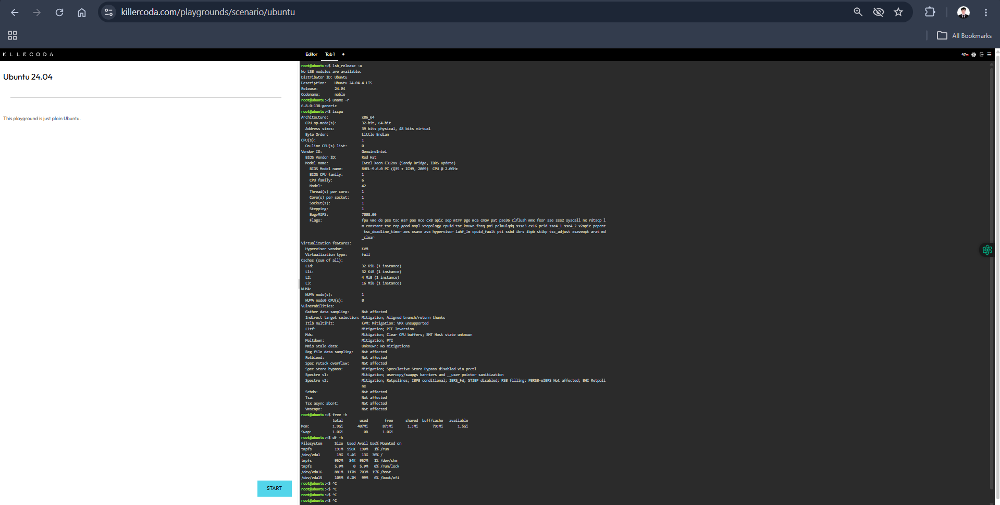
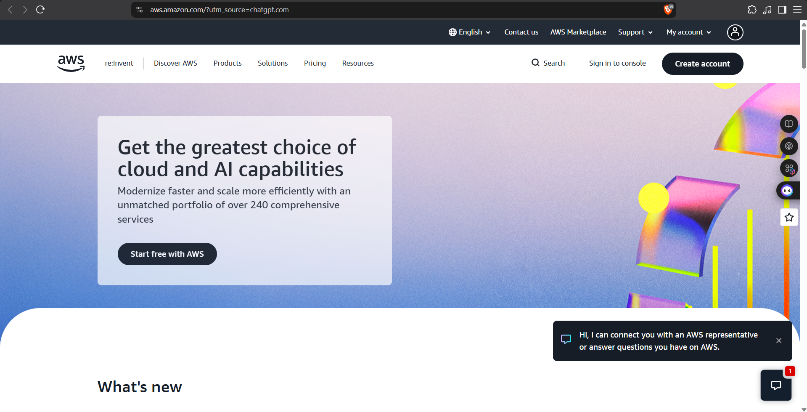
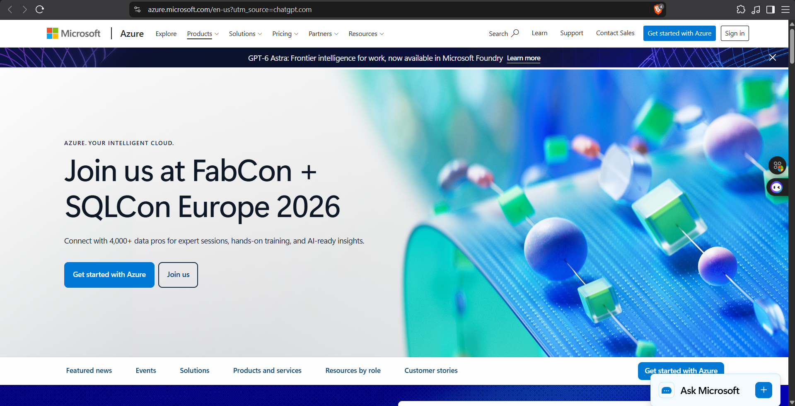
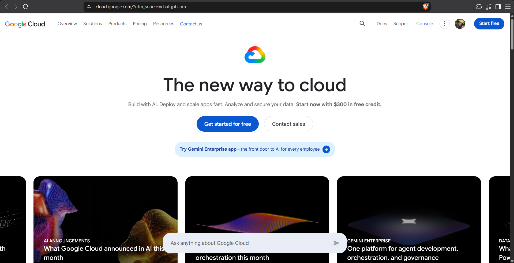
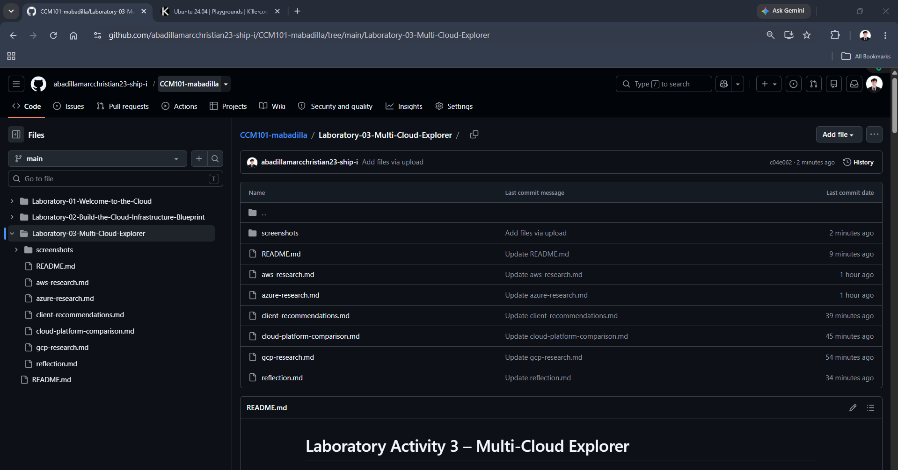

# Laboratory Activity 3 – Multi-Cloud Explorer

## Mission 3

**Course:** CCM101 – Cloud Computing
**Laboratory Activity:** 3
**Mission:** Become a Multi-Cloud Explorer

---

## Mission Overview

This laboratory activity focuses on the evaluation of three major public cloud platforms: Amazon Web Services (AWS), Microsoft Azure, and Google Cloud Platform (GCP).

The main purpose of this mission is to understand that cloud platform selection is a technical and business decision. Instead of automatically selecting the most popular provider, the appropriate platform should be matched with the client's budget, existing technology, workload, scalability requirements, and future goals.

---

# Mission Objectives

After completing this laboratory activity, I was able to:

* Explore AWS, Microsoft Azure, and Google Cloud.
* Identify important cloud services.
* Compare equivalent services between providers.
* Analyze different business scenarios.
* Recommend cloud platforms based on requirements.
* Investigate a Linux environment using command-line tools.
* Document technical findings using Markdown.
* Organize cloud computing work in GitHub.

---

# Cloud Platforms Investigated

## Amazon Web Services

AWS provides cloud services for computing, storage, networking, databases, security, analytics, and application development. Its infrastructure is distributed across Regions and Availability Zones.

## Microsoft Azure

Microsoft Azure provides cloud infrastructure and platform services and is especially useful for organizations that already use Microsoft technologies. Azure currently describes its infrastructure as having 80+ regions and 500+ datacenters.

## Google Cloud

Google Cloud provides services for computing, storage, databases, AI, machine learning, data analytics, and Kubernetes. Its current global locations information highlights its worldwide cloud and AI infrastructure.

---

# Checkpoint 7 – Linux Investigation

## Commands Used

### 1. Operating System

```bash
lsb_release -a
```

This command was used to identify the Linux distribution and version.

### 2. Kernel

```bash
uname -r
```

This command displays the Linux kernel version.

### 3. CPU Information

```bash
lscpu
```

This command displays information about the processor, CPU architecture, cores, threads, and other CPU characteristics.

### 4. Memory

```bash
free -h
```

This command displays RAM and memory usage in a human-readable format.

### 5. Disk Space

```bash
df -h
```

This command displays the available and used disk space of mounted filesystems.

---


---

## Terminal Evidence



The screenshot above contains the Linux commands and their corresponding outputs collected during the investigation.

---

# Cloud Hosting Options for the Linux Server

If the investigated Linux server were migrated to the cloud, each major provider could host it using a virtual machine service.

| Provider        | Cloud Service          | Purpose                        |
| --------------- | ---------------------- | ------------------------------ |
| AWS             | Amazon EC2             | Host the Linux virtual machine |
| Microsoft Azure | Azure Virtual Machines | Host the Linux virtual machine |
| Google Cloud    | Compute Engine         | Host the Linux virtual machine |

The operating system does not have to change simply because the server is moved to the cloud. The cloud provider supplies the virtualized computing infrastructure while the Linux operating system can run inside the virtual machine.

---

# Evidence Screenshots

## AWS



## Microsoft Azure



## Google Cloud



## KillerCoda


## GitHub Repository



---

# What I Learned

This laboratory helped me understand that AWS, Azure, and Google Cloud are not completely different concepts. They provide many equivalent services, but each provider has a different ecosystem and area of strength.

I also learned that Linux knowledge remains useful even when working with cloud platforms. A cloud virtual machine is still an operating system environment that needs to be investigated, configured, secured, and maintained.

---

# Mission Conclusion

Mission 3 changed my perspective on cloud computing because I learned that choosing a provider involves more than comparing service names. The client's existing technology, budget, workload, performance requirements, scalability, and future plans all affect the final decision.

For general-purpose workloads, I consider AWS a strong option. For organizations deeply invested in Microsoft technologies, Azure is more appropriate, while Google Cloud becomes particularly attractive for AI, data, and Kubernetes-focused workloads.
