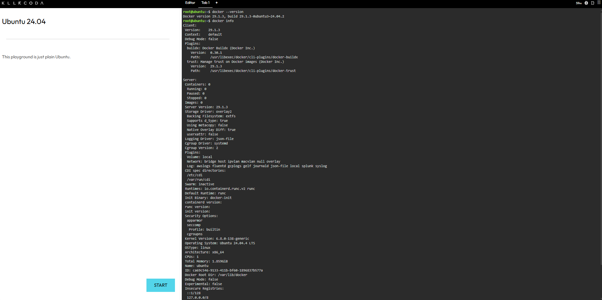
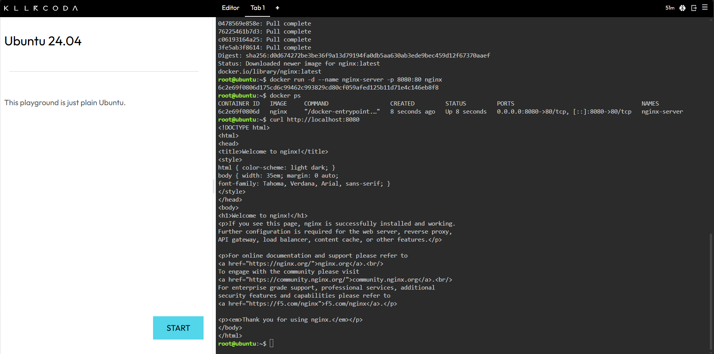
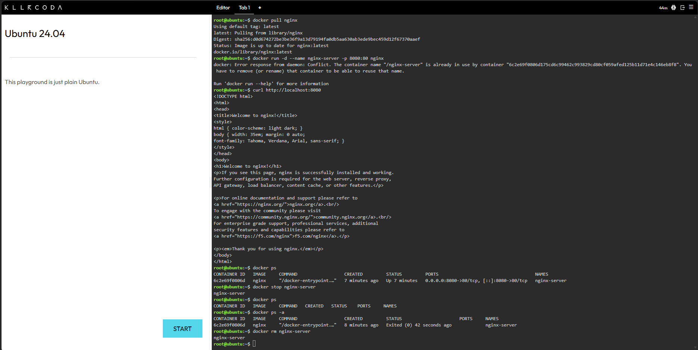

# Laboratory Activity 4 – Cloud-Native Engineer

## Mission Overview

This laboratory activity introduces containerization using Docker. The mission focuses on understanding the difference between Virtual Machines and Containers and deploying a web server using a Docker container.

## Objectives

* Understand the differences between Virtual Machines and Containers.
* Verify that Docker is installed and running.
* Pull and run an Nginx Docker image.
* Use port mapping to expose a web server.
* Manage the lifecycle of a Docker container.
* Document Docker commands and procedures using Markdown.
* Maintain an organized GitHub cloud computing portfolio.

## Docker Commands Executed

The following Docker commands were used during the activity:

| Command                                              | Purpose / What It Does                                                                                                                          |
| ---------------------------------------------------- | ----------------------------------------------------------------------------------------------------------------------------------------------- |
| `docker --version`                                   | Displays the installed Docker version and confirms that Docker is available in the system.                                                      |
| `docker info`                                        | Shows detailed information about the Docker installation, including the Docker engine, containers, images, and system configuration.            |
| `docker pull nginx`                                  | Downloads the official Nginx image from Docker Hub so it can be used to create a container.                                                     |
| `docker run -d --name nginx-server -p 8080:80 nginx` | Creates and starts an Nginx container in detached mode. It names the container `nginx-server` and maps host port `8080` to container port `80`. |
| `docker ps`                                          | Displays the Docker containers that are currently running.                                                                                      |
| `curl http://localhost:8080`                         | Sends a request to the Nginx web server through port `8080` to verify that the server is accessible.                                            |
| `docker stop nginx-server`                           | Stops the running Nginx container.                                                                                                              |
| `docker ps`                                          | Checks the running containers to verify that the Nginx container has stopped.                                                                   |
| `docker ps -a`                                       | Displays all containers, including running and stopped containers.                                                                              |
| `docker rm nginx-server`                             | Removes the stopped `nginx-server` container from Docker.                                                                                       |

### Port Mapping

The command below uses port mapping:

```bash
docker run -d --name nginx-server -p 8080:80 nginx
```

The `-p 8080:80` option connects the **host port 8080** to the **container port 80**. This allows the Nginx web server inside the container to be accessed through:

```text
http://localhost:8080
```

## Skills Learned

Through this activity, I learned how Docker containers work and how they differ from Virtual Machines. I also learned how to pull images, create and run containers, map ports, test a web server, and manage the container lifecycle using Docker commands. I also improved my Markdown documentation and GitHub portfolio organization.

## Challenges Encountered

One challenge was understanding the difference between the host port and the container port when using port mapping. I also needed to make sure that the Docker commands were executed in the correct order, especially when stopping and removing the container. Another challenge was documenting the terminal output and saving the screenshots with the correct filenames.

## Screenshots

### Checkpoint 3 – Docker Installation and Environment Status



### Checkpoint 4 – Successful Nginx Web Server Test



### Checkpoint 5 – Container Stop, Verification, and Removal


