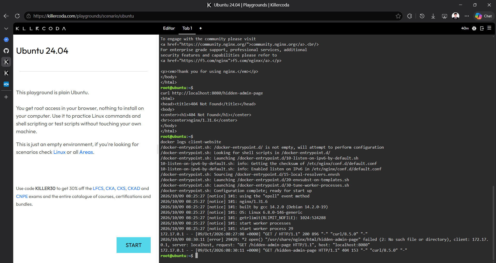
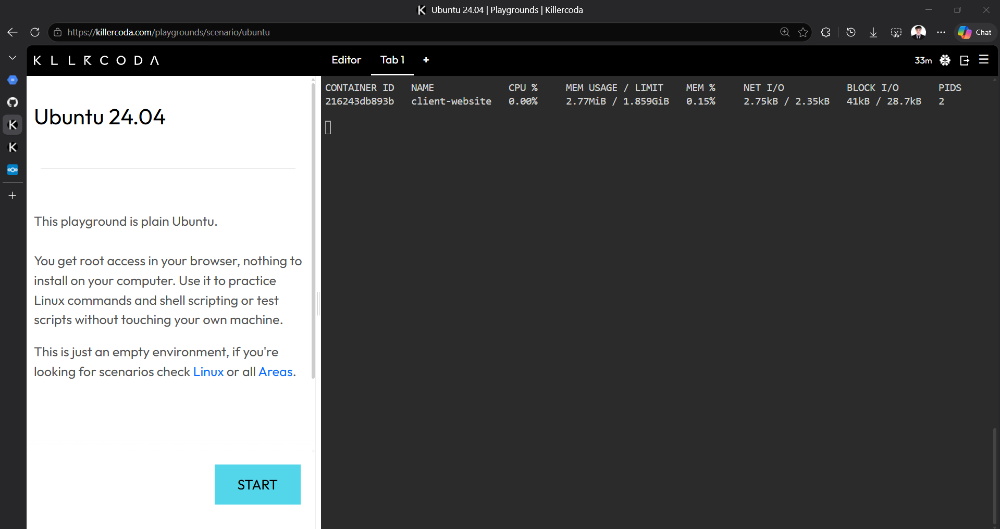

# Container Observability Report

## Checkpoint 4: Application Logging

### Command Used

```bash
docker logs client-website
```

The command displayed the startup messages and HTTP access logs of the Nginx container named `client-website`.

### 404 Error Log

```text
172.17.0.1 - - [09/Oct/2026:08:30:11 +0000] "GET /hidden-admin-page HTTP/1.1" 404 153 "-" "curl/8.5.0" "-"
```

### Log Analysis

The log shows that a request was made to `/hidden-admin-page`, but Nginx returned HTTP status `404` because the requested file did not exist. This confirms that the server recorded the unsuccessful request, which can help an engineer identify missing resources and investigate application issues.

### Why Application Logs Are Important

Application logs provide a record of requests and errors that occur while a service is running. They help engineers investigate problems using actual evidence, such as requested URLs, timestamps, and HTTP status codes, instead of guessing what caused the issue.

### Screenshot Evidence




## Checkpoint 5: Real-Time Container Metrics

### Command Used

```bash
docker stats
```

### Observed Container Metrics

| Metric                  | Actual Result     |
| ----------------------- | ----------------- |
| Container Name          | `client-website`  |
| Container ID            | `216243db893b`    |
| CPU Usage               | 0.00%             |
| Memory Usage            | 2.77 MiB          |
| Memory Limit            | 1.859 GiB         |
| Memory Usage Percentage | 0.15%             |
| Network I/O             | 2.75 kB / 2.35 kB |
| Block I/O               | 41 kB / 28.7 kB   |
| Processes (PIDS)        | 2                 |

### Analysis

The `client-website` container used 0.00% CPU and 2.77 MiB of memory during the observation. Its memory consumption was only 0.15% of the displayed limit, indicating low resource usage while the Nginx server was running.

The network and block I/O values also show that the container had recorded data transfer and disk activity. However, these results represent only the container's condition at the time of monitoring and do not prove that it can handle thousands of simultaneous users.


### Screenshot Evidence — Real-Time Container Metrics

The screenshot below shows the actual CPU usage, memory consumption, network I/O, and block I/O of the `client-website` container during monitoring.


